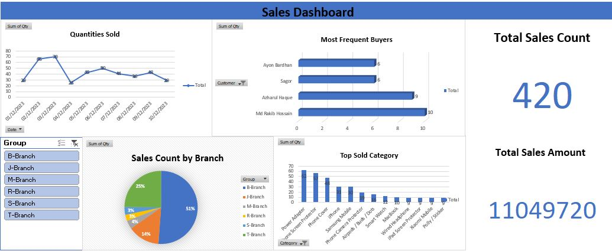
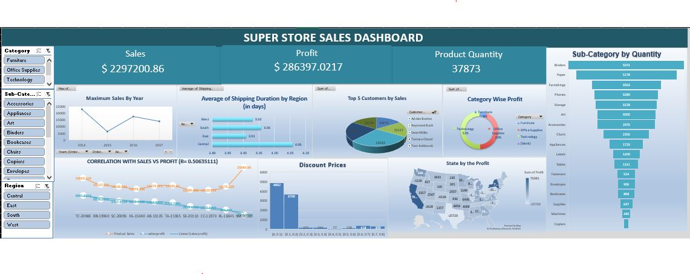
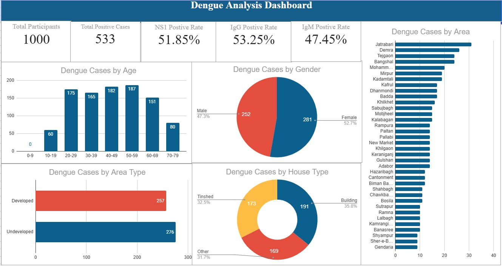

# Excel Dashboard

## Sales Dashboard

# Dashboard Description
This Sales Dashboard visually presents key sales metrics and insights, focusing on quantities sold, sales distribution across branches, top buyers, and product performance. It is organized with the following sections:
- Quantities Sold (Line Chart): This section tracks the total quantities sold over time, allowing users to see trends and fluctuations in sales volume.
- Most Frequent Buyers (Bar Chart): This chart highlights the top buyers by the number of purchases, helping identify the most active customers and potential loyal clients.
- Sales Count by Branch (Pie Chart): The pie chart shows the percentage distribution of sales counts across various branches, providing insights into branch performance.
- Top Sold Category (Bar Chart): This section lists the top-selling product categories, helping understand which products contribute the most to sales.
- Total Sales Count and Sales Amount (Key Metrics): The dashboard prominently displays the total number of sales and the total sales amount, giving a quick overview of overal performance.

# Features
- Interactive Filters: Users can filter data by Group and Date, making it easy to drill down into specific time periods or branch details.
- Visual Representation: Different chart types (line, pie, and bar) allow users to quickly grasp key insights at a glance.
- Clear Metrics: Key metrics like "Total Sales Count" and "Total Sales Amount" are highlighted for a quick snapshot of overall sales performance.

## Superstore Dashboard

## Dashboard Description

The Superstore Sales Dashboard provides comprehensive insights into sales, profits, product quantities, and other key metrics. It is structured with the following sections:

- **Maximum Sales by Year (Line Chart):** Displays the annual sales trends to identify the most profitable years and observe growth patterns.
- **Average Shipping Duration by Region (Bar Chart):** Highlights the average time taken for shipping in different regions, aiding in logistical analysis.
- **Top 5 Customers by Sales (Pie Chart):** Showcases the top-performing customers contributing the highest sales.
- **Category-wise Profit (Donut Chart):** Explores profitability across various product categories, helping to assess category performance.
- **Correlation Between Sales and Profit (Scatter Plot):** Visualizes the relationship between sales and profit to identify efficient strategies.
- **Discount Prices (Bar Chart):** Examines the impact of discounts on sales volumes and profit margins.
- **State-wise Profit (Map Visualization):** Highlights geographic regions with the most profit to target growth opportunities.
- **Sub-Category by Quantity (Bar Chart):** Lists the sub-categories with the highest sales quantities, allowing targeted inventory planning.

## Features

- **Interactive Filters:** Users can filter by Category, Region, or Sub-Category, enabling dynamic analysis of specific segments.
- **Detailed Metrics:** Key indicators like "Sales," "Profit," and "Product Quantity" are prominently displayed for quick performance assessment.
- **Diverse Visualization Types:** Combines line charts, scatter plots, maps, and pie charts to provide a well-rounded view of data.
- **Region-Specific Insights:** The dashboard highlights regional and state-wise performance, offering strategic decision-making capabilities.

# Google Sheets

# Dengue Analysis Dashboard

## Dashboard Description

The Dengue Analysis Dashboard provides an overview of dengue case statistics, focusing on participant data, demographics, and case distributions. It is organized into the following sections:

- **Total Participants and Positive Cases (Key Metrics):** Displays the total number of participants surveyed and the total number of confirmed dengue cases, providing a quick summary of the dataset.
- **NS1, IgG, and IgM Positive Rates (Key Metrics):** Highlights the percentage of positive cases for NS1, IgG, and IgM tests, offering insights into diagnostic trends.
- **Dengue Cases by Age (Bar Chart):** Shows the distribution of dengue cases across different age groups, helping identify the most affected demographics.
- **Dengue Cases by Gender (Pie Chart):** Breaks down dengue cases by gender, highlighting male and female proportions.
- **Dengue Cases by Area (Bar Chart):** Lists the regions with the highest number of dengue cases, providing a geographic perspective on the spread.
- **Dengue Cases by Area Type (Horizontal Bar Chart):** Compares the number of cases in developed versus underdeveloped areas, offering insights into environmental factors.
- **Dengue Cases by House Type (Donut Chart):** Categorizes cases based on house types (e.g., Tinshed, Building, and Other), aiding in understanding housing-related risk factors.

## Features

- **Detailed Metrics:** Displays key indicators like "Total Participants," "Total Positive Cases," and positive test rates for NS1, IgG, and IgM.
- **Demographic Insights:** Visualizations provide age, gender, and housing-based breakdowns of dengue cases.
- **Geographic and Environmental Analysis:** Highlights area-specific trends, including developed vs. underdeveloped regions, and housing conditions.
- **Clear and Concise Visualizations:** A mix of bar charts, pie charts, and donut charts ensure quick understanding of complex data.
